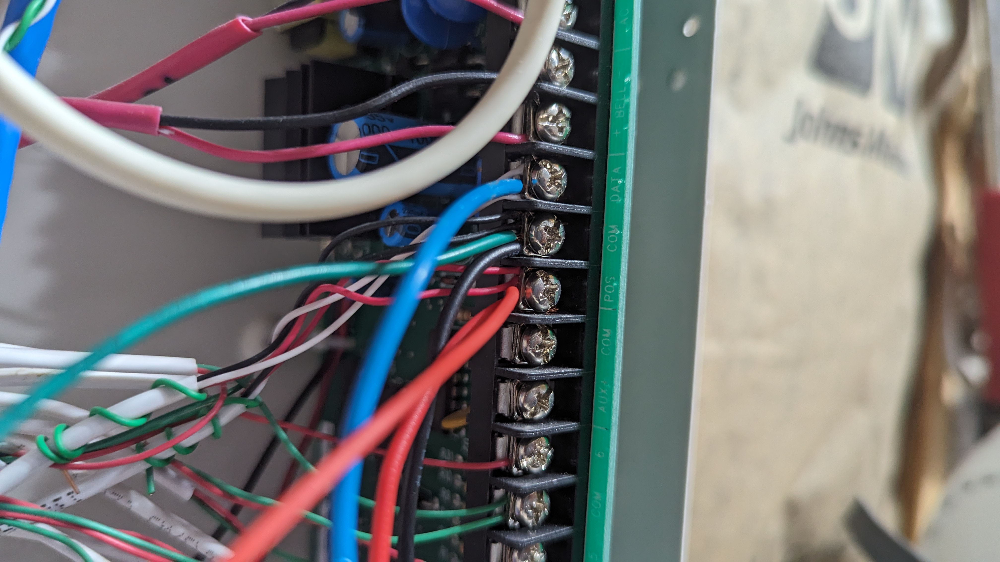

# NX6v2 Compatibility and Lessons Learned

#### This is a contribution from TJ Patel. He took the effort to read my mean an lean instructions and by asking questions, he now contributes his experience for those that are ready to give it a try.
---

First off, big thanks to HacK for putting together this ESP project, figuring out how to integrate with the NetworX bus, and the countless hours, tips, and tricks he provided along my journey to integrate it with my alarm panel! To pay it forward, here's a few things I learned from HacK and others that may help the next person build their integration.

## NetworX NX-6v2

Yes, the NX-6V2 is supported by the original code base, and it appears to use the same bus message protocol and voltage!

## Receive Only Mode

Read alarm status and zone triggers, with only an ESP8266. As a proof of concept, you can wire up the ESP8266 to read from the NX panel only. This will allow you to see the alarm status and zone that are triggered. For this, you’ll need the ESP8266 and a couple of resistors for the voltage divider. Once you get this working, you can move on to writing to the bus which will require a few more bits. See schematic.

## Docker Container for rtos MAC users

I followed [this guide](https://www.studiopieters.nl/installation/) to use a docker container for the build environment to make it easier to make code updates to the project on my Mac.

HacK also has a docker container with esp-open-rtos that has everything you need to get started as well:  

```bash
docker pull homeaccessorykid/esp-open-rtos:20220108
```
[note from HacK: flashing from docker on a mac is not possible without using e.g. a parallels VM or other tricks. However, if you create the binaries and use the docker shared volume, you can then use ESPtool from the mac itself.]

## Command and bins to flash

For the first flash to the ESP, you’ll need the following. This will setup ESP Home and wipe the config, so you can connect directly to ESP wifi for configuration.

```bash
esptool.py -p /dev/cu.usbserial-B001XHLZ --baud 115200 write_flash -fs 4MB -fm dout -ff 40m 0x0 rboot.bin 0x1000 blank_config.bin 0x2000 main.bin
```

If you end up tweaking the code case for your needs, subsequent flashes can use the following:

```bash
esptool.py -p /dev/cu.usbserial-B001XHLZ --baud 115200 write_flash -fs 4MB -fm dout -ff 40m 0x2000 firmware/main.bin
```

## Divider circuit issues, floating ground

Note, the 33k/10k resistor divider that HacK recommends for the NX8 works for the NX6V2 bus as well. Just be sure to double-check all wiring as I had a loose connection which led me down a rabbit hole trying to figure out why I was not getting a good bus signal. I used a breadboard for prototyping/demo purposes and think a pin may have been loose. If I were to do it again, I probably would’ve just soldered the divider circuit from the get-go to avoid this.

## Home Assistant Homekit supported

Home Assistant is what I use as my home automation controller. It's open source and has integrations with many different devices across ecosystems, so it serves as a central hub for my various IoT, z-wave, tasmota, and now HomeKit devices. We're mostly an Android household, so I didn't have any Apple devices handy to serve as the Homekit controller nor run Eve. But the Home Assistant integration has the core HomeKit controller functionality covered and works well with this ESP codebase. [Home Assistant HomeKit Controller](https://www.home-assistant.io/integrations/homekit_controller/).

Note, HomeAccessoryKid's codebase supports some very useful features with the Eve app, such as toggling debug mode, uploading new firmware, and setting the alarm PIN-code. If using Home Assistant, unfortunately you miss out on these features and have to make code changes and reflash the firmware manually.

Since I’ve hardcoded the pin for the time being, anyone who gets physical access to ESP would have access to this pin and that’s a security threat. To help mitigate this, I created a 2nd user and PIN just for the ESP so that I can disable/change this pin when necessary.

HacK believes it should possible to map these Eve toggles to standard Apple HomeKit UUIDs so they can be accessible in Home Assistant.  I haven't got around to testing that yet, but its on my todo list.

## Pairing the ESP with the NX panel

Before pairing the ESP with the NX panel, enable debugging and check the logs to see which console addresses are already in use. I had 2 existing keypads and these are the messages I saw:

```
49 7637: 1c0 10 d0 91
12 7649: 108 44 00 4c a0

52 11989: 1c8 10 d8 a1
9 11998: 108 44 00 4c a0
```

The 1st in each pair is the NX panel polling all registered keypads and the “108 44 00 4c a0” message is the ping back from each keypad. Increase by 8 each time, so in my case, d0 was the next free address to use. Update the code if necessary to use this address. The code base by default uses d8, so in most cases, this may work as-is. If not, update the MY_ID definition:

```c
#define MY_ID 0xd8
```

To register the ESP, follow the steps in the manual for enrolling a new module/keypad, i.e., enter the programming mode, then exit, and wait 12 seconds. During this wait, the NX panel is pinging all addresses to see which respond back with a ping, and will register those devices, including our new ESP. You should see this ping and ping response in the debug logs.

*Excerpt from the manual:*

"X. ENROLLING MODULES AND KEYPADS For supervision purposes, the NX-6V2 has the ability to automatically find and store in its memory, the presence of all keypads, zone expanders, wireless receivers, and any other module connected to the data terminal. This allows these modules to be supervised by the control panel. To enroll the modules, enter the Program Mode of the NX-6V2 control panel as described on page 8. When the Program Mode is exited, the NX-6V2 control will automatically enroll the devices. The enrolling process takes about 12 seconds, during which time the "Service" LED will illuminate. User codes will not be accepted during the enrolling process. If a speaker is attached to the NX-6V2, it will click at this time. If a siren or bell is attached to the NX-6V2, it will sound for about 1 second. Once a module is enrolled, if it is not detected by the control, the "Service" LED will illuminate."

[NX6v2 Install Manual](https://www.thealarmstore.com/wp-content/uploads/2019/06/NX6v2-Install.pdf)

## Disable service beep

The NX panel may trigger the keypads to sound if the ESP fails to respond back to a ping after it's been paired. For example, if you unplug or reboot the ESP after it paired, this may trigger. If you want to turn this off, per the manual, the scenario is called "expander troubled" and it can be disabled by programming "Location 39 - Keypad Sounder Control" and toggling option 8 "On if keypad sounds for expander troubled". If there is a problem, the service LED will still illuminate to notify you.

## Enable debugging

If you are using Home Assistant’s homekit controller, you won’t get access to the special homekit device parameters to enable debugging. To work around this, replace the DEBUGP macro with either:

```c
#define DEBUGP(format,...) printf(format, ##__VA_ARGS__)
#define DEBUGP(format,...) UDPLUS(format, ##__VA_ARGS__)
```

## Powering the ESP using the BUS voltage

To power the ESP8266, I had a leftover 5v USB adapter from a previous car project that I had bought off Amazon. Since the bus voltage, ~13.5V, falls within its acceptable input range, I wired it up to the +/- of the bus terminals on the NX6v2 panel and used that to power my ESP8266 which had a built in 5v to 3.3v regulator to power itself.  

ADAFRUIT HUZZAH ESP8266 BRKT
https://www.adafruit.com/product/2471

Car USB power adapter
https://www.amazon.com/gp/product/B081NCXB2M/

## Sourcing hardware

I was able to find the ESP8266 and resistors at my local microcenter, which is all you'll need for reading the NX bus.  I used this Adafruit Huzzah ESP8266 breakout board and a generic resistor pack
https://www.microcenter.com/product/458078/adafruit-industries-huzzah-esp8266-breakout

https://www.microcenter.com/product/618896/inland-1-4-watt-1-resistors-610-pack

To enable writing to the bus to arm/disarm the system, you'll need a 4512 (e.g. NTE4512B) IC and a basic NPN transistor (e.g. 2N3904, BC547).  I was not able to find this locally, so HacK helped me find a source that delivers in the USA.  I used Elliott Electronic Supply.  Here's links to the parts I used:

https://www.elliottelectronicsupply.com/catalog/product/view/id/15685/s/ic-cmos-multiplexer/category/2/

https://www.elliottelectronicsupply.com/catalog/product/view/id/8604/s/transistor-gp-bjt-npn-40v-0-2a/category/2/


*PHOTOS*



